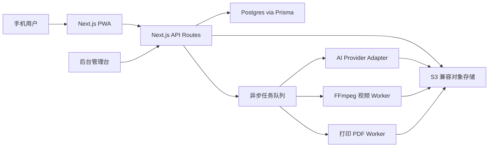

# AI Flipbook Studio MVP Implementation Plan

> **For Claude:** REQUIRED SUB-SKILL: Use superpowers:executing-plans to implement this plan task-by-task.

**Goal:** 搭建 AI Flipbook Studio 第一版移动端 PWA MVP，让用户可以上传/生成素材、预览翻页书、提交微信联系订单草稿，后台可以人工审核和履约。

**Architecture:** 使用 Next.js 全栈应用承载移动端 PWA、API routes 和后台管理台。业务数据存 Postgres，素材文件存 S3 兼容对象存储，AI、视频处理、打印 PDF 通过异步任务和 provider adapter 执行。第一阶段先用 mock AI 和 mock print worker 跑通用户体验，再接入真实 AI 服务和 FFmpeg/PDF 处理。

**Tech Stack:** Next.js App Router, React, TypeScript, Tailwind CSS, Prisma, Postgres, S3-compatible storage, Inngest 或 DB-backed worker queue, FFmpeg, Vitest, React Testing Library, Playwright.

---

## 0. 产品与工程假设

- MVP 是移动端优先，体验像一个轻量创作工具，而不是传统电商页。
- 第一版只有一个固定 SKU：口袋礼物版翻页书，3-5 秒，约 45-60 帧。
- MVP 不接在线支付。用户提交订单草稿后，由团队通过微信人工确认和收款。
- MVP 不做用户账号系统。项目通过生成 ID 追踪，后台负责人工审核。
- AI 服务必须通过 adapter 封装，后续可以替换服务商。
- 第一阶段先做 mock AI，保证前端和业务流程先跑通。
- 人工审核是 MVP 的安全兜底，不追求一开始全自动生产。

## 1. 第一版技术架构



推荐项目结构：

```text
src/
  app/
    page.tsx
    layout.tsx
    globals.css
    create/page.tsx
    preview/[projectId]/page.tsx
    order/[projectId]/page.tsx
    admin/page.tsx
    admin/orders/[orderId]/page.tsx
    api/
      projects/route.ts
      projects/[projectId]/route.ts
      jobs/[jobId]/route.ts
      orders/route.ts
      admin/orders/route.ts
  components/
    ui/
    creation/
    flipbook/
    admin/
  domain/
    product.ts
    templates.ts
    prompt.ts
    types.ts
  server/
    db/
    storage/
    ai/
    jobs/
    print/
    video/
  test/
    setup.ts
prisma/
  schema.prisma
tests/
  e2e/
```

## 2. 开发里程碑

### 里程碑 1：项目外壳

交付一个能跑起来的移动端 Next.js 应用，包含测试、Tailwind、基础布局和 PWA 友好的 metadata。

验收标准：

- `npm run dev` 可以启动应用。
- 首页展示两个创作入口：「上传视频做翻页书」和「AI 生成我的幻想翻页书」。
- `npm test` 通过。
- `npm run lint` 通过。

### 里程碑 2：创作流程原型

交付完整前端创作流程：选择创作方式、选择模板、上传/选择参考素材、微调描述、进入预览。

验收标准：

- 两个创作入口都能不用真实 AI 跑通。
- 模板和 prompt builder 有单元测试。
- 390px 手机宽度下布局可用。

### 里程碑 3：翻页预览与订单草稿

交付翻页书预览和订单草稿表单。

验收标准：

- 用户可以拖动或自动播放翻页预览。
- 用户可以提交微信号、手机号、收货地址、用途和备注。
- API 可以校验订单草稿字段。

### 里程碑 4：数据库、存储与任务记录

交付项目、素材、AI 任务、打印任务、订单的数据持久化。

验收标准：

- 创建项目会写入 Postgres。
- 素材 metadata 会被记录。
- AI 和打印任务以可重试 job 形式记录。
- API 测试覆盖字段校验和状态流转。

### 里程碑 5：后台人工履约台

交付一个简单后台，让团队能人工处理订单。

验收标准：

- 后台可以按状态查看订单。
- 后台可以查看订单详情、素材、prompt、任务和备注。
- 后台可以更新状态：已提交、已联系、已收款、制作中、已发货、已取消。

### 里程碑 6：Worker 集成边界

交付 AI、FFmpeg 抽帧、打印 PDF 的 worker 边界。

验收标准：

- mock AI provider 在开发环境返回稳定输出。
- FFmpeg worker 可以从本地测试视频抽帧。
- Print worker 可以从帧图生成可下载 PDF。
- 真实 AI 服务可以通过实现 adapter 接入。

### 里程碑 7：PWA QA 与上线准备

交付移动端测试、端到端测试和上线清单。

验收标准：

- Playwright 覆盖从创作到提交订单的 happy path。
- 移动端和桌面端关键页面截图检查通过。
- 环境变量有文档。
- 后台人工履约流程有文档。

## 3. 任务拆解

### Task 1: 搭建 Next.js 应用和基础工具

**Files:**

- Create: `package.json`
- Create: `tsconfig.json`
- Create: `next.config.mjs`
- Create: `postcss.config.mjs`
- Create: `tailwind.config.ts`
- Create: `vitest.config.ts`
- Create: `playwright.config.ts`
- Create: `src/test/setup.ts`
- Create: `src/app/layout.tsx`
- Create: `src/app/page.tsx`
- Create: `src/app/globals.css`
- Create: `src/app/page.test.tsx`

**Step 1: 安装基础依赖**

Run:

```bash
npm install next react react-dom
npm install -D typescript @types/node @types/react @types/react-dom tailwindcss postcss autoprefixer vitest @testing-library/react @testing-library/jest-dom jsdom playwright eslint eslint-config-next
```

Expected: 依赖安装完成，并生成 `package-lock.json`。

**Step 2: 添加 npm scripts**

`package.json` 需要包含：

```json
{
  "scripts": {
    "dev": "next dev",
    "build": "next build",
    "start": "next start",
    "lint": "next lint",
    "test": "vitest run",
    "test:watch": "vitest",
    "test:e2e": "playwright test"
  }
}
```

**Step 3: 先写失败测试**

Create `src/app/page.test.tsx`:

```tsx
import { render, screen } from "@testing-library/react";
import HomePage from "./page";

test("shows both creation entries", () => {
  render(<HomePage />);
  expect(screen.getByText("上传视频做翻页书")).toBeInTheDocument();
  expect(screen.getByText("AI 生成我的幻想翻页书")).toBeInTheDocument();
});
```

**Step 4: 运行测试确认失败**

Run:

```bash
npm test
```

Expected: 在首页还没实现两个入口前，测试失败。

**Step 5: 实现最小首页**

`src/app/page.tsx` 渲染两个清晰的入口：

- 上传视频做翻页书
- AI 生成我的幻想翻页书

**Step 6: 验证**

Run:

```bash
npm test
npm run lint
npm run build
```

Expected: 全部通过。

**Step 7: 提交**

```bash
git add package.json package-lock.json tsconfig.json next.config.mjs postcss.config.mjs tailwind.config.ts vitest.config.ts playwright.config.ts src
git commit -m "chore: scaffold flipbook studio app"
```

### Task 2: 定义产品常量和领域类型

**Files:**

- Create: `src/domain/types.ts`
- Create: `src/domain/product.ts`
- Create: `src/domain/product.test.ts`

**Step 1: 写固定 SKU 测试**

```ts
import { POCKET_FLIPBOOK_SKU } from "./product";

test("pocket flipbook sku locks first version constraints", () => {
  expect(POCKET_FLIPBOOK_SKU.durationSeconds.min).toBe(3);
  expect(POCKET_FLIPBOOK_SKU.durationSeconds.max).toBe(5);
  expect(POCKET_FLIPBOOK_SKU.frameCount.min).toBe(45);
  expect(POCKET_FLIPBOOK_SKU.frameCount.max).toBe(60);
});
```

**Step 2: 实现产品常量**

```ts
export const POCKET_FLIPBOOK_SKU = {
  id: "pocket-gift-v1",
  name: "口袋礼物版翻页书",
  durationSeconds: { min: 3, max: 5 },
  frameCount: { min: 45, max: 60 },
  fulfillment: "manual_wechat",
} as const;
```

**Step 3: 定义共享类型**

`src/domain/types.ts` 至少包含：

- `CreationMode`
- `UploadVideoAiMode`
- `AssetType`
- `OrderStatus`
- `AiJobType`
- `AiJobStatus`
- `PrintJobStatus`

**Step 4: 验证并提交**

```bash
npm test
git add src/domain
git commit -m "feat: define flipbook product model"
```

### Task 3: 建立模板库和 Prompt Builder

**Files:**

- Create: `src/domain/templates.ts`
- Create: `src/domain/prompt.ts`
- Create: `src/domain/prompt.test.ts`

**Step 1: 写 prompt builder 测试**

```ts
import { buildPrompt } from "./prompt";
import { TEMPLATES } from "./templates";

test("builds guided prompt from template fields", () => {
  const template = TEMPLATES.find((item) => item.id === "pet-moon-run")!;
  const prompt = buildPrompt(template, {
    subject: "一只白色小狗",
    scene: "月球表面",
    mood: "开心、梦幻",
    blessing: "",
  });

  expect(prompt).toContain("一只白色小狗");
  expect(prompt).toContain("月球表面");
  expect(prompt).toContain("开心、梦幻");
});
```

**Step 2: 实现模板库**

先创建 8-12 个模板，覆盖：

- 上传视频：AI 换背景
- 上传视频：整段风格化
- AI 生成视频：参考图/视频生成幻想短片

每个模板包含：

- `id`
- `name`
- `category`
- `mode`
- `shortDescription`
- `requiredInputs`
- `defaultPrompt`
- `negativePrompt`
- `estimatedSeconds`

**Step 3: 实现 prompt builder**

逻辑要求：

- 合并模板 prompt 和用户字段。
- 自动过滤空字段。
- 保留 `negativePrompt` 给 AI provider 使用。

**Step 4: 验证并提交**

```bash
npm test
git add src/domain/templates.ts src/domain/prompt.ts src/domain/prompt.test.ts
git commit -m "feat: add guided AI templates"
```

### Task 4: 实现创作流程状态机

**Files:**

- Create: `src/features/creation/creationState.ts`
- Create: `src/features/creation/creationState.test.ts`

**Step 1: 写状态流转测试**

```ts
import { createInitialState, creationReducer } from "./creationState";

test("selects creation mode and advances to template step", () => {
  const state = creationReducer(createInitialState(), {
    type: "selectMode",
    mode: "ai_generated_video",
  });

  expect(state.mode).toBe("ai_generated_video");
  expect(state.step).toBe("template");
});
```

**Step 2: 实现 reducer**

支持这些步骤：

- `entry`
- `template`
- `upload`
- `prompt`
- `processing`
- `preview`
- `order`

支持这些 action：

- `selectMode`
- `selectTemplate`
- `setUpload`
- `setPromptInputs`
- `startProcessing`
- `completeProcessing`
- `reset`

**Step 3: 验证并提交**

```bash
npm test
git add src/features/creation
git commit -m "feat: add creation wizard state"
```

### Task 5: 搭建移动端创作 UI

**Files:**

- Create: `src/components/ui/Button.tsx`
- Create: `src/components/ui/SegmentedControl.tsx`
- Create: `src/components/creation/CreationEntry.tsx`
- Create: `src/components/creation/TemplatePicker.tsx`
- Create: `src/components/creation/PromptForm.tsx`
- Create: `src/components/creation/CreationEntry.test.tsx`
- Create: `src/app/create/page.tsx`

**Step 1: 写组件测试**

```tsx
import { render, screen } from "@testing-library/react";
import { CreationEntry } from "./CreationEntry";

test("renders consumer creation entries", () => {
  render(<CreationEntry onSelectMode={() => {}} />);
  expect(screen.getByText("上传视频做翻页书")).toBeInTheDocument();
  expect(screen.getByText("AI 生成我的幻想翻页书")).toBeInTheDocument();
});
```

**Step 2: 实现 UI 组件**

需要包含：

- Button
- SegmentedControl
- CreationEntry
- TemplatePicker
- PromptForm

视觉要求：

- 移动端优先。
- 第一屏直接创作，不做传统 landing page。
- 文案简短，不解释技术细节。

**Step 3: 接入 `/create` 路由**

用户应该能完成：

- 选择创作入口
- 选择模板
- 填写 prompt 字段
- 进入上传/预览前的下一步

**Step 4: 验证并提交**

```bash
npm test
npm run lint
git add src/components src/app/create
git commit -m "feat: build creation flow UI"
```

### Task 6: 增加素材上传校验

**Files:**

- Create: `src/domain/mediaValidation.ts`
- Create: `src/domain/mediaValidation.test.ts`
- Create: `src/components/creation/MediaUpload.tsx`

**Step 1: 写上传校验测试**

```ts
import { validateMediaFile } from "./mediaValidation";

test("accepts short mp4 video", () => {
  const result = validateMediaFile({
    name: "clip.mp4",
    type: "video/mp4",
    size: 12 * 1024 * 1024,
  });

  expect(result.ok).toBe(true);
});

test("rejects unsupported media type", () => {
  const result = validateMediaFile({
    name: "file.txt",
    type: "text/plain",
    size: 100,
  });

  expect(result.ok).toBe(false);
});
```

**Step 2: 实现校验规则**

初始规则：

- 接受 `video/mp4`, `video/quicktime`, `image/jpeg`, `image/png`, `image/webp`
- 视频软限制 100 MB
- 图片软限制 20 MB
- 返回中文错误提示

**Step 3: 实现上传 UI**

上传 UI 展示：

- 文件名
- 文件大小
- 校验状态
- 错误提示

此阶段还不需要真实对象存储。

**Step 4: 验证并提交**

```bash
npm test
git add src/domain/mediaValidation.ts src/domain/mediaValidation.test.ts src/components/creation/MediaUpload.tsx
git commit -m "feat: validate creation media uploads"
```

### Task 7: 增加 Mock AI 任务流程

**Files:**

- Create: `src/server/ai/types.ts`
- Create: `src/server/ai/provider.ts`
- Create: `src/server/ai/mockProvider.ts`
- Create: `src/server/ai/mockProvider.test.ts`
- Create: `src/app/api/jobs/route.ts`
- Create: `src/app/api/jobs/[jobId]/route.ts`

**Step 1: 写 adapter 测试**

```ts
import { mockAiProvider } from "./mockProvider";

test("mock provider returns deterministic job output", async () => {
  const result = await mockAiProvider.generateVideo({
    templateId: "pet-moon-run",
    prompt: "一只白色小狗在月球奔跑",
    assetIds: ["asset_1"],
  });

  expect(result.status).toBe("completed");
  expect(result.outputAssetId).toMatch(/^mock-video-/);
});
```

**Step 2: 定义 provider interface**

接口包含：

- `replaceBackground`
- `stylizeVideo`
- `generateVideo`

每个方法都要有 typed input 和 typed output。

**Step 3: 实现 mock provider**

返回稳定的 ID、状态和 mock 输出，方便 UI 和 API 在没有真实 AI 时测试。

**Step 4: 添加 job API routes**

原型阶段可以返回 mock job 状态。真实持久化在 Task 10 接入。

**Step 5: 验证并提交**

```bash
npm test
git add src/server/ai src/app/api/jobs
git commit -m "feat: add mock AI job adapter"
```

### Task 8: 实现翻页书预览组件

**Files:**

- Create: `src/domain/frames.ts`
- Create: `src/domain/frames.test.ts`
- Create: `src/components/flipbook/FlipbookPreview.tsx`
- Create: `src/components/flipbook/FlipbookPreview.test.tsx`
- Create: `src/app/preview/[projectId]/page.tsx`

**Step 1: 写帧生成测试**

```ts
import { buildMockFrames } from "./frames";

test("creates fixed preview frames inside MVP range", () => {
  const frames = buildMockFrames("project_1");
  expect(frames.length).toBeGreaterThanOrEqual(45);
  expect(frames.length).toBeLessThanOrEqual(60);
});
```

**Step 2: 实现 mock frames**

原型阶段生成 frame metadata，可以用 placeholder image URL 或 CSS 背景。

**Step 3: 实现预览组件**

组件支持：

- 拖动/滑动翻页
- 自动播放
- 当前帧计数
- 稳定的移动端尺寸

**Step 4: 写组件测试**

测试用户点击/滑动时，当前帧计数会更新。

**Step 5: 验证并提交**

```bash
npm test
npm run lint
git add src/domain/frames.ts src/domain/frames.test.ts src/components/flipbook src/app/preview
git commit -m "feat: add flipbook preview"
```

### Task 9: 增加订单草稿表单和校验

**Files:**

- Create: `src/domain/orderValidation.ts`
- Create: `src/domain/orderValidation.test.ts`
- Create: `src/components/creation/OrderDraftForm.tsx`
- Create: `src/app/order/[projectId]/page.tsx`
- Create: `src/app/api/orders/route.ts`

**Step 1: 写表单校验测试**

```ts
import { validateOrderDraft } from "./orderValidation";

test("requires wechat and phone before order submission", () => {
  const result = validateOrderDraft({
    customerName: "小王",
    wechatId: "",
    phone: "",
    shippingAddress: "上海市",
    occasion: "生日礼物",
    userNote: "",
  });

  expect(result.ok).toBe(false);
  expect(result.errors.wechatId).toBeDefined();
  expect(result.errors.phone).toBeDefined();
});
```

**Step 2: 实现校验**

必填字段：

- customerName
- wechatId
- phone
- shippingAddress

选填字段：

- occasion
- userNote

**Step 3: 实现订单表单**

提交成功后展示：团队会通过微信联系你确认效果、价格和制作。

**Step 4: 实现 API route**

先返回 mock persistence response。真实数据库接入在 Task 10。

**Step 5: 验证并提交**

```bash
npm test
git add src/domain/orderValidation.ts src/domain/orderValidation.test.ts src/components/creation/OrderDraftForm.tsx src/app/order src/app/api/orders
git commit -m "feat: add order draft submission"
```

### Task 10: 增加数据库 Schema 和 Repository

**Files:**

- Create: `prisma/schema.prisma`
- Create: `src/server/db/client.ts`
- Create: `src/server/db/orders.ts`
- Create: `src/server/db/projects.ts`
- Create: `src/server/db/assets.ts`
- Create: `src/server/db/jobs.ts`
- Create: `src/server/db/orders.test.ts`
- Modify: `src/app/api/orders/route.ts`
- Modify: `src/app/api/jobs/route.ts`

**Step 1: 安装 Prisma**

```bash
npm install @prisma/client
npm install -D prisma
```

Expected: Prisma 依赖安装完成。

**Step 2: 创建 Prisma schema**

Models:

- `Order`
- `Project`
- `Asset`
- `Template`
- `AiJob`
- `PrintJob`
- `AdminUser`

字段以产品设计文档为准。

**Step 3: 写 repository 测试**

测试：

- 创建订单
- 更新订单状态
- 查询订单详情

根据本地环境选择 test database 或 mocked Prisma client。

**Step 4: 生成 Prisma client**

```bash
npx prisma generate
```

Expected: Prisma client 生成成功。

**Step 5: API 接入 repository**

订单提交 API 创建：

- Project record
- Order record
- 初始 AI job 或 print job record

**Step 6: 验证并提交**

```bash
npm test
npm run lint
git add prisma src/server/db src/app/api/orders src/app/api/jobs package.json package-lock.json
git commit -m "feat: persist projects orders and jobs"
```

### Task 11: 增加素材存储 Adapter

**Files:**

- Create: `src/server/storage/types.ts`
- Create: `src/server/storage/localStorageAdapter.ts`
- Create: `src/server/storage/s3StorageAdapter.ts`
- Create: `src/server/storage/storage.test.ts`
- Modify: `src/app/api/projects/route.ts`

**Step 1: 写 storage adapter 测试**

```ts
import { localStorageAdapter } from "./localStorageAdapter";

test("local storage adapter returns asset metadata", async () => {
  const asset = await localStorageAdapter.createAssetReference({
    fileName: "clip.mp4",
    contentType: "video/mp4",
    size: 1024,
  });

  expect(asset.storageUrl).toContain("clip.mp4");
});
```

**Step 2: 定义 storage interface**

接口包含：

- `createAssetReference`
- `getUploadUrl`
- `getDownloadUrl`
- `deleteAsset`

**Step 3: 先实现 local adapter**

用于本地开发和测试。

**Step 4: 增加 S3 adapter 外壳**

读取环境变量。凭证缺失时抛出清晰错误，不阻塞 mock/local 开发。

**Step 5: 验证并提交**

```bash
npm test
git add src/server/storage src/app/api/projects
git commit -m "feat: add media storage adapter"
```

### Task 12: 搭建后台管理台

**Files:**

- Create: `src/components/admin/OrderStatusBadge.tsx`
- Create: `src/components/admin/OrderList.tsx`
- Create: `src/components/admin/OrderDetail.tsx`
- Create: `src/components/admin/OrderList.test.tsx`
- Create: `src/app/admin/page.tsx`
- Create: `src/app/admin/orders/[orderId]/page.tsx`
- Create: `src/app/api/admin/orders/route.ts`
- Create: `src/app/api/admin/orders/[orderId]/route.ts`

**Step 1: 写后台列表测试**

```tsx
import { render, screen } from "@testing-library/react";
import { OrderList } from "./OrderList";

test("shows order status and wechat contact", () => {
  render(
    <OrderList
      orders={[
        {
          id: "order_1",
          status: "submitted",
          customerName: "小王",
          wechatId: "wx123",
          createdAt: "2026-06-02",
        },
      ]}
    />
  );

  expect(screen.getByText("小王")).toBeInTheDocument();
  expect(screen.getByText("wx123")).toBeInTheDocument();
});
```

**Step 2: 实现订单列表**

支持按状态查看：

- submitted
- awaiting_review
- contacted
- paid
- in_production
- shipped
- cancelled

**Step 3: 实现订单详情**

展示：

- 用户联系方式
- 收货地址
- 用途和备注
- 模板和 prompt
- 素材链接
- AI job 状态
- print job 状态
- 内部备注

**Step 4: 实现状态更新 API**

只允许合法状态值，拒绝非法状态。

**Step 5: 验证并提交**

```bash
npm test
npm run lint
git add src/components/admin src/app/admin src/app/api/admin
git commit -m "feat: add admin fulfillment dashboard"
```

### Task 13: 增加打印任务和 PDF Worker 边界

**Files:**

- Create: `src/server/print/types.ts`
- Create: `src/server/print/printLayout.ts`
- Create: `src/server/print/printLayout.test.ts`
- Create: `src/server/print/mockPrintWorker.ts`
- Create: `src/server/jobs/printJobRunner.ts`

**Step 1: 写 print layout 测试**

```ts
import { buildPrintLayout } from "./printLayout";

test("creates print layout using pocket sku frame range", () => {
  const layout = buildPrintLayout({
    projectId: "project_1",
    frameAssetIds: Array.from({ length: 50 }, (_, index) => `frame_${index}`),
  });

  expect(layout.frameCount).toBe(50);
  expect(layout.safeMarginMm).toBeGreaterThan(0);
});
```

**Step 2: 实现 print layout model**

包含：

- trim size placeholder
- bleed
- safe margin
- frame ordering
- PDF output asset reference

**Step 3: 实现 mock print worker**

返回 fake `print_pdf` asset ID，让后台下载流程先能测试。

**Step 4: 验证并提交**

```bash
npm test
git add src/server/print src/server/jobs/printJobRunner.ts
git commit -m "feat: add print job worker boundary"
```

### Task 14: 增加 FFmpeg 抽帧 Worker

**Files:**

- Create: `src/server/video/ffmpeg.ts`
- Create: `src/server/video/frameExtraction.ts`
- Create: `src/server/video/frameExtraction.test.ts`
- Create: `src/server/jobs/videoJobRunner.ts`
- Create: `fixtures/videos/sample-short.mp4`

**Step 1: 写抽帧计划测试**

```ts
import { planFrameExtraction } from "./frameExtraction";

test("plans frame extraction inside pocket flipbook range", () => {
  const plan = planFrameExtraction({
    durationSeconds: 4,
    targetFrames: 50,
  });

  expect(plan.frameCount).toBe(50);
  expect(plan.fps).toBeCloseTo(12.5);
});
```

**Step 2: 实现抽帧计划**

根据视频时长和目标帧数计算 FPS，并把帧数限制在 45-60 之间。

**Step 3: 实现 FFmpeg wrapper**

包装参数：

- input path
- output directory
- fps
- crop/scale settings

**Step 4: 添加 FFmpeg 集成测试**

如果本地没有 FFmpeg binary，则跳过集成测试。抽帧计划测试必须始终运行。

**Step 5: 验证并提交**

```bash
npm test
git add src/server/video src/server/jobs/videoJobRunner.ts fixtures
git commit -m "feat: add video frame extraction worker"
```

### Task 15: 连接创作流程和 Project API

**Files:**

- Create: `src/app/api/projects/route.ts`
- Create: `src/app/api/projects/[projectId]/route.ts`
- Create: `src/features/creation/useCreateProject.ts`
- Modify: `src/app/create/page.tsx`
- Modify: `src/app/preview/[projectId]/page.tsx`
- Modify: `src/app/order/[projectId]/page.tsx`

**Step 1: 写 API 行为测试**

测试创建项目时返回：

- project ID
- job ID
- next route

**Step 2: 实现 project create API**

接受：

- creation mode
- template ID
- prompt inputs
- asset references

返回：

- project ID
- job ID
- status

**Step 3: 连接前端流程**

用户完成模板、prompt、上传后，创建 project 并进入处理/预览。

**Step 4: 验证并提交**

```bash
npm test
npm run lint
git add src/app/api/projects src/features/creation src/app/create src/app/preview src/app/order
git commit -m "feat: connect creation flow to project API"
```

### Task 16: 增加端到端 Happy Path 测试

**Files:**

- Create: `tests/e2e/create-order.spec.ts`
- Modify: `playwright.config.ts`

**Step 1: 写 Playwright 测试**

```ts
import { test, expect } from "@playwright/test";

test("user creates a flipbook order draft", async ({ page }) => {
  await page.goto("/");
  await page.getByText("AI 生成我的幻想翻页书").click();
  await page.getByText("我的宠物在月球奔跑").click();
  await page.getByLabel("主角").fill("一只白色小狗");
  await page.getByRole("button", { name: "继续" }).click();
  await expect(page.getByText("翻页预览")).toBeVisible();
  await page.getByRole("button", { name: "提交订单草稿" }).click();
  await page.getByLabel("微信号").fill("wx123");
  await page.getByLabel("手机号").fill("13800138000");
  await page.getByLabel("收货地址").fill("上海市");
  await page.getByRole("button", { name: "提交" }).click();
  await expect(page.getByText("我们会通过微信联系你")).toBeVisible();
});
```

**Step 2: 运行 E2E 测试**

```bash
npm run test:e2e
```

Expected: 在 UI route 和 selector 没对齐前失败。

**Step 3: 修正流程**

调整 label、button 和路由，直到测试符合真实 happy path。

**Step 4: 验证并提交**

```bash
npm test
npm run test:e2e
npm run build
git add tests/e2e playwright.config.ts src
git commit -m "test: cover flipbook order happy path"
```

### Task 17: 增加环境文档和上线清单

**Files:**

- Create: `.env.example`
- Create: `docs/engineering/mvp-architecture.md`
- Create: `docs/operations/manual-fulfillment.md`
- Create: `docs/operations/launch-checklist.md`

**Step 1: 创建 `.env.example`**

```bash
DATABASE_URL=
STORAGE_PROVIDER=local
S3_ENDPOINT=
S3_BUCKET=
S3_ACCESS_KEY_ID=
S3_SECRET_ACCESS_KEY=
AI_PROVIDER=mock
ADMIN_SESSION_SECRET=
```

**Step 2: 写工程架构文档**

说明：

- PWA
- API routes
- Postgres
- object storage
- job queue
- AI adapter
- FFmpeg worker
- print worker

**Step 3: 写人工履约文档**

流程：

- 查看新订单
- 通过微信联系
- 确认效果
- 人工收款
- 生成/下载打印 PDF
- 更新制作状态
- 更新发货状态

**Step 4: 写上线检查清单**

包含：

- 移动端 happy path
- 后台 happy path
- 上传限制
- AI 失败提示
- 隐私提示
- 联系字段
- 打印 PDF 下载
- AI 失败兜底方案

**Step 5: 提交**

```bash
git add .env.example docs/engineering docs/operations
git commit -m "docs: add mvp architecture and launch checklist"
```

## 4. 推荐实施顺序

1. Task 1: 搭建 Next.js 应用和基础工具
2. Task 2: 定义产品常量和领域类型
3. Task 3: 建立模板库和 Prompt Builder
4. Task 4: 实现创作流程状态机
5. Task 5: 搭建移动端创作 UI
6. Task 6: 增加素材上传校验
7. Task 7: 增加 Mock AI 任务流程
8. Task 8: 实现翻页书预览组件
9. Task 9: 增加订单草稿表单和校验
10. Task 10: 增加数据库 Schema 和 Repository
11. Task 11: 增加素材存储 Adapter
12. Task 12: 搭建后台管理台
13. Task 13: 增加打印任务和 PDF Worker 边界
14. Task 14: 增加 FFmpeg 抽帧 Worker
15. Task 15: 连接创作流程和 Project API
16. Task 16: 增加端到端 Happy Path 测试
17. Task 17: 增加环境文档和上线清单

## 5. 第一版发布定义

满足以下条件后，可以进入小范围私测：

- 手机用户能完成一次创作流程。
- 手机用户能看到翻页书预览。
- 手机用户能提交微信联系方式订单草稿。
- 后台能看到提交的订单。
- 后台能查看素材、prompt、任务状态和备注。
- 后台能更新人工履约状态。
- Print worker 能从帧图生成可下载 PDF。
- AI worker 能以 mock mode 跑通，并保留真实 provider adapter。
- Playwright 覆盖核心 happy path。

## 6. 已知风险

- 真实 AI 视频生成可能慢、贵、不稳定。
- 主体身份保持可能不够好，需要人工审核。
- 手机端大视频上传在弱网下容易失败。
- Serverless 平台可能不适合重型 FFmpeg 处理。
- 翻页书尺寸、纸张、裁切和装订仍需要实物测试。
- MVP 没有账号系统，用户不能方便地恢复未完成项目。

## 7. 接入真实 AI 前要决定的问题

- 第一版 reference-to-video 用哪个 AI provider。
- 第一版视频风格化用哪个 AI provider。
- 背景替换是直接用 provider，还是 mask + composite 两步流程。
- AI 生成是在用户提交订单前发生，还是提交联系方式后再生成。
- 翻页书准确尺寸、出血、装订边。
- Worker 是否要部署在独立服务器，而不是 Next.js 应用同一平台。

## 8. 执行交接

计划已保存到 `docs/plans/2026-06-02-ai-flipbook-studio-mvp-implementation.md`。

两个执行方式：

1. **本会话逐步实施**：在这个会话里一项一项做，每个任务后检查。
2. **另开实施会话**：打开一个新的开发会话，按这份计划逐项执行。

推荐先在本会话做 Tasks 1-5，因为现在项目是空白起点，早期产品手感和页面体验需要边做边看。

